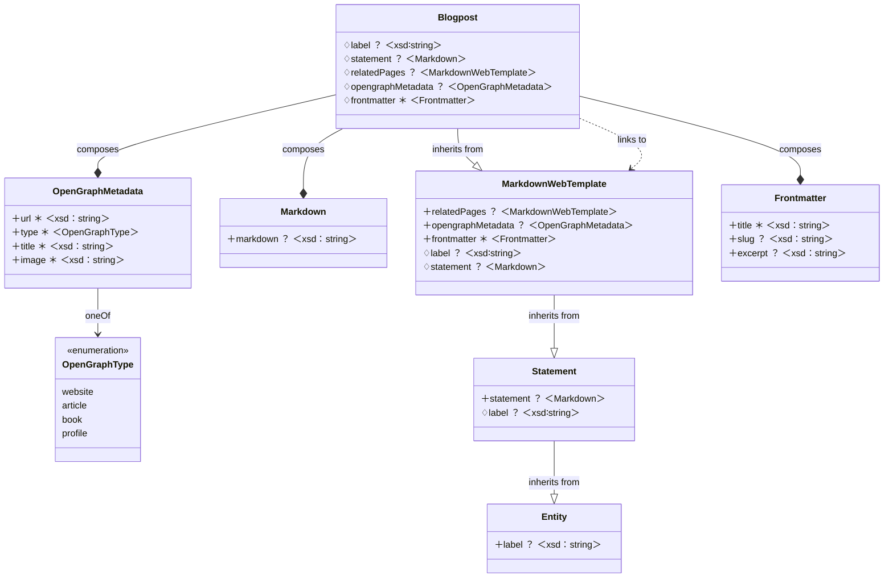

# gatsby-gql-template
Gatsby template with TerminusDB GraphQL and Tailwind CSS

Using this template, a statically built website can be built from a TerminusDB data product. In this base version, a customizable GraphQL query is used to pull blogposts from a data product based on data product templates provided by DFRNT.

By adding Pages, Persons, related web pages, sections and more into the data product, it can easily be rendered as a website.

## Overview of implemented integrations

These are the main subsystems

* Markdown - Embedded in TerminusDB data products (hope for MDX in the future)
* GraphQL - Interface for [DFRNT.com](https://dfrnt.com) TerminusDB data products
* TailwindCSS - Utility CSS framework
* Typescript

The main work is performed by createPages in `gatsby-node.ts`.

To get started, you need the following:
* A token to connect with DFRNT or TerminusCMS (or credentials to localhost)
* A hosted TerminusDB data product ([or with some work, locally[](https://dfrnt.com/](https://dfrnt.com/blog/2023-02-25-run-terminusdb-on-windows-with-docker/))
* The schema, set it up easily through DFRNT, or refer to the Mermaid diagram below
* Blogpost entries in your TerminusDB data product

Start the development server (you need the `.env.development`):

```sh
$ npm update
$ npm install
$ npx gatsby develop
```

To build for production (you need the `.env.production`):
```sh
$ npx gatsby build
```

## Implement GraphQL querying

This template queries a TerminusDB Data Product using GraphQL, based on the schema provided below. 

To get the connection to DFRNT (the same principles apply when connecting directly to TerminusCMS) going, you need to add your details. Go to the section `gatsby-source-graphql` in ``gatsby-config.ts`. Configure with relevant URLs including the instance, dataproduct and branch, based on the provided templates. 

The comments should articulate how to configure it, make sure to make a copy into the `.env.development´ file with your token, based on the template file. Or supply the environment variable with your token in some other way (do not hard code it!).

Your TerminusDB Data Product will need relevant types and data structures. These are easiest to created with the DFRNT Schema Template helper, but can be importent manually to TerminusDB as well based on the exported Type Composition diagram below, copied from the tool. Be mindful of the order when importing the types as they are interdependent:

1. OpenGraphType
2. Frontmatter
3. OpenGraphMetadata
4. Markdown
5. Entity
6. MarkdownWebTemplate
7. Blogpost

Once the types are added to the TerminusDB instance, create a few blogpost entries. I have included a simple template below, which related to itself just as an example.



### Example Blogpost entry

```json
{
  "@type": "Blogpost",
  "@id": "Blogpost/c49b43d0ac1023450c58dbd80c22792a19c0d37b1d9e486b6d834686c26c9388",
  "frontmatter": {
    "@type": "Frontmatter",
    "excerpt": "This is a page summary",
    "title": "A page about a lot of things",
    "slug": "blog/blogpost"
  },
  "label": "Blogpost example",
  "opengraphMetadata": {
    "@type": "OpenGraphMetadata",
    "image": "http://localhost:8000/blog/blogpost/image.jpg",
    "title": "Blogpost example",
    "type": "website",
    "url": "http://localhost:8000/blog/blogpost/"
  },
  "statement": {
    "@type": "Markdown",
    "markdown": "# Heading 1\n\n## Heading 2\n\n### Heading 3\n\nSome content\n\n```\nAnd some code\n```"
  },
  "relatedPages": "Blogpost/c49b43d0ac1023450c58dbd80c22792a19c0d37b1d9e486b6d834686c26c9388"
}
```

### Improvement opportunities

This initial version does not make use of the built-in Markdown transformations available in Gatsby. The initial idea was to use MDX, but the current Gatsby MDX implementation only supports MDX transformations from files (PRs are more than welcome).

It would be great to get support for MDX some day. The MDX team are working on more generic support, basesd on GitHub conversation linked [TECH_SETUP.md](./TECH_SETUP.md). Hopefully this will be possible in a near future in Gatsby and we can update this template accordingly.

## Licence and support

This template is Copyright 2023 [DFRNT AB](https://dfrnt.com), and licensed under the MIT license. 

The template is offered free of charge to the TerminusDB community and is unsupported. We do welcome issue and pull requests to help improve the template and documentation for it.